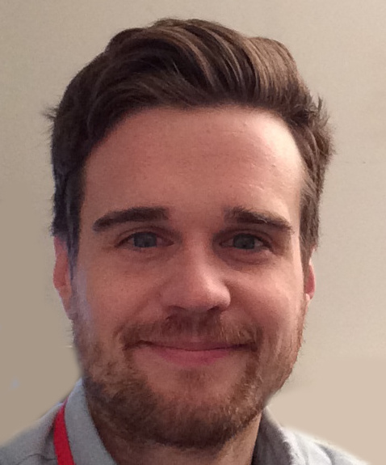

# Enseignants

## Professeur.e.s

Michel-Pierre Coll, PhD (Automne 2023) is an Assistant Professor of Psychological and Brain Sciences at Dartmouth College and directs the [Computational Social Affective Neuroscience Laboratory](http://cosanlab.com/). He completed a BA in psychology at Reed College, an MA in psychology at the New School for Social Research, and a PhD in clinical psychology and cognitive neuroscience at the University of Arizona with Alan Sanfey, PhD. He completed his predoctoral clinical internship training in behavioral medicine at the University of California Los Angeles and a postdoctoral fellowship at the University of Colorado Boulder under the mentorship of Tor Wager, PhD. His research program is focused on understanding the neurobiological and computational mechanisms underlying emotions and social interactions. Professor Chang is highly committed to innovating training in methods. He is the lead developer of the [dartbrains](https://dartbrains.org/) course, the [nltools](https://neurolearn.readthedocs.io/en/latest/) python data analysis project, the [Computational Social and Affective Neuroscience](http://compsan.org/) community page, and Co-Director of the [Methods in Neuroscience at Dartmouth Computational Summer School](http://mindsummerschool.org/).

## Assistant.e.s

[Wasita Mahaphanit](https://wasita.space/) (Fall 2022) graduated from Brown University with a BS in Cognitive Neuroscience. She managed a lab at Brown after graduation, where she investigated the behavioral and computational mechanisms underlying learning and decision-making under uncertainty in healthy adults and patients with obsessive compulsive disorder. She currently works in the [COSAN Lab](http://cosanlab.com/), where she studies how we learn social cognitive maps and use this information in how we communicate and make decisions.

